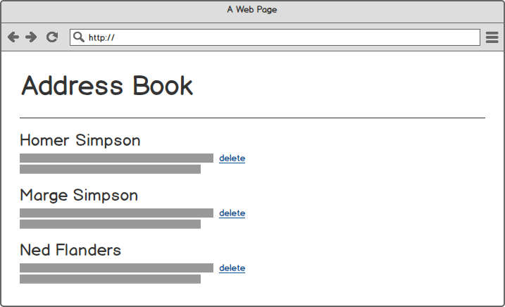
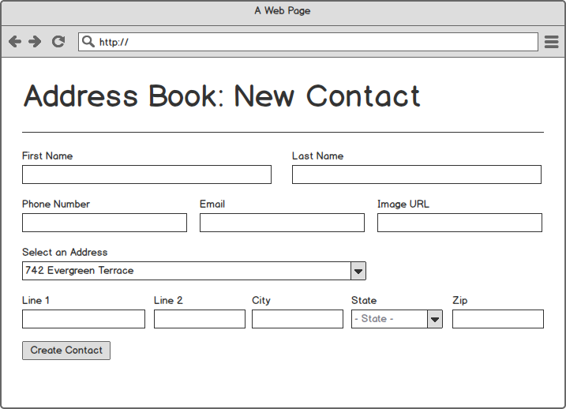

# Address Book CRUD

Create an address book web application that allows you to:

* Create new contacts
* Edit existing contacts
* Delete existing contacts

---

### Entry Ticket

To complete this project, you will need to understand:

* How to create a simple server via Node and Express
* How to setup a database with multiple, connected tables
* How to connect your server to your database
* How to render HTML with templates

---

### Setup

1. Create a Node/Express application. You can roll your own or use the [Galvanize Express Generator](https://github.com/gSchool/generator-galvanize-express).

1. Create a new database called `address_book_crud`.

1. Create a `contacts` table with the following columns:
  > id, first_name, last_name, phone_number, email_address, image_url

1. Create a `addresses` table with the following columns:
  > id, line_1, line_2, city, zip

1. Connect the two tables so that addresses could belong to many contacts.

---

### Routes & Pages

Your web application should create the following routes with the following constraints:

__GET '/'__
* Should return all contacts and display them on the page with all their fields and their address. If two people share the same address, the address is shown under each listing.
* Each listing has a delete button or link.
* At the top of the page is a New Contact button.

__DELETE '/contacts/:id'__
* Deletes the specified contact. If it is the only contact associated with a particular address, delete the address as well.
* Redirects the user back to homepage after deletion.

__GET '/contacts/new'__
* Displays a new contact form on the page. The form should include form validation where all inputs are required.
* The address fields should be included in the form as well. However, there should be a select box above them which allows the user to choose from an already existing address. The text in each option will be __line_1__ and __line_2__ joined together. If the user selects an option, the address fields are pre-populated.

__POST '/contacts'__
* Creates a new contact in the database.
* If the provided address is exactly the same as another one already in the __addresses table__, do _not_ create a new row; instead, associate the pre-existing address and the contact.
* If it is a new address, create a new address row in the __address table__ and associate the address with the contact.
* Redirect back to the homepage after correctly creating the contact.

---

### Stretch Goal

Done? Implement messaging:

1. Create a `messages` table with the following columns:
  > id, method, content

1. Associate messages with contacts so that contacts can have many messages.

1. Change the email and phone-number for each contact on the homepage to link to `/contacts/:id/messages/new`. Send a query parameter along that denotes what type of message it will be.
  * For example, `/contacts/3/messages/new?method=email`

1. Include a text area where you can add a message. If the type of message is phone/text, limit the characters to 100.

1. On submit, a new message gets created in the database storing the method and content of the message. It then redirects you back to the homepage.
  * Additionally, send an email or text the user! You can send free text messages with the [Textbelt API](http://textbelt.com/). For email, check out [Nodemailer](https://github.com/nodemailer/nodemailer) -- note that you'll need to do some configuration to get emails working.

1. Create a new page called `/messages` where all messages to your contacts are listed.
# address_CRUD
